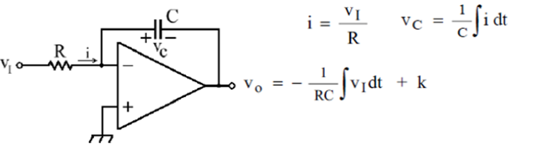
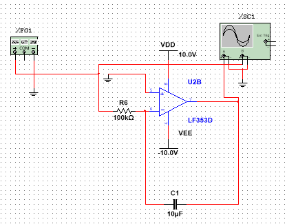
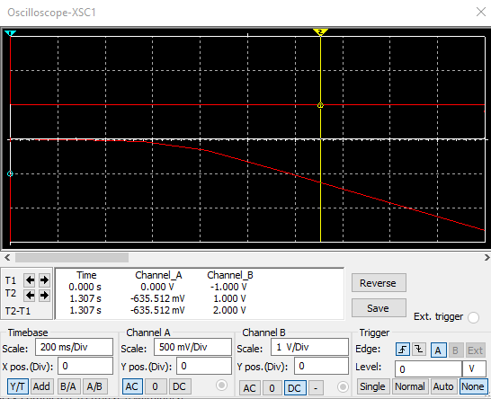
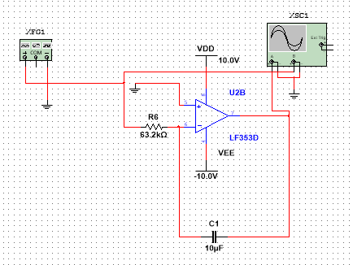
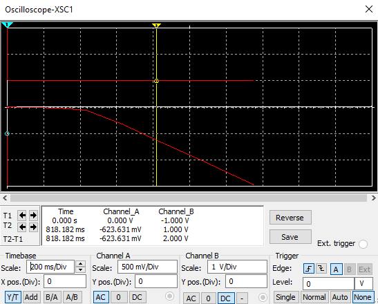
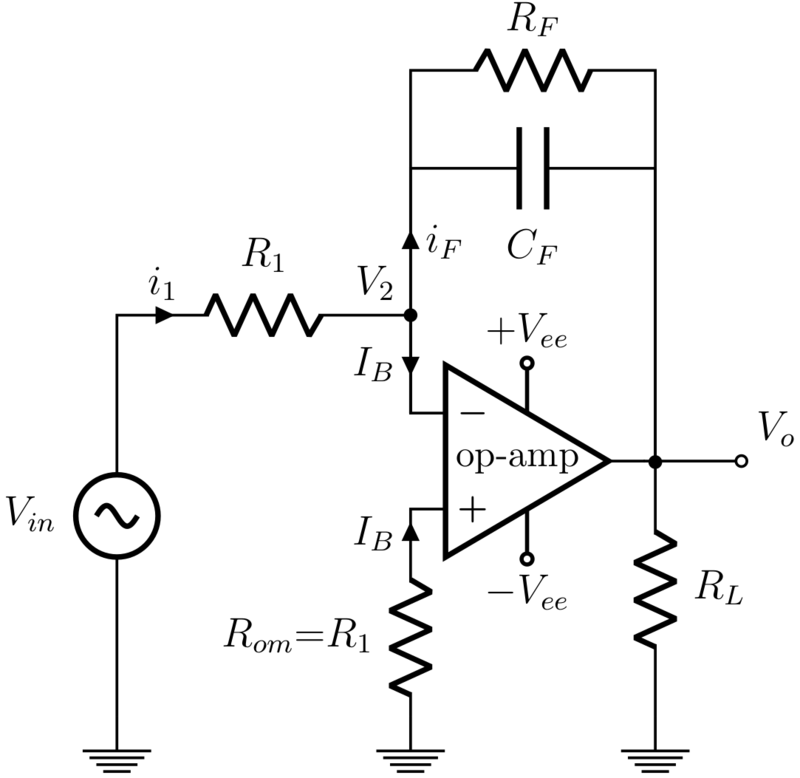
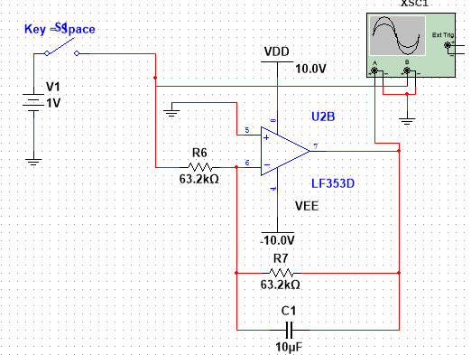
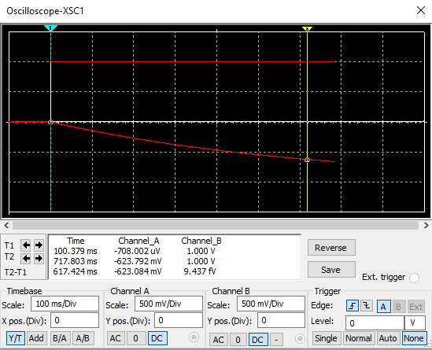
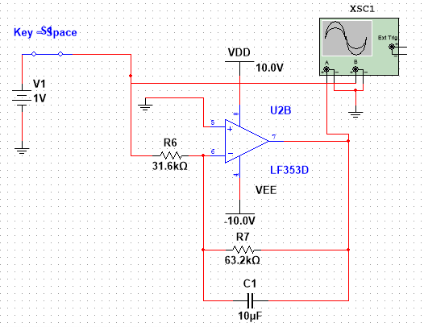
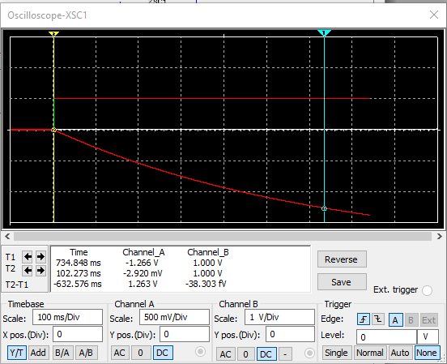

# Diseño de integradores con amplificadores operacionales para entradas de tensión constante
# Introducción

Los circuitos con amplificadores operacionales frecuentemente requieren la ejecución de operaciones matemáticas de cierta complejidad, por ejemplo las integrales o derivadas de una función por medio de señales de voltaje.

Específicamente en el área de control son necesarias las operaciones de integral para lograr el funcionamiento de los controladores PID o incluso para la solución de ecuaciones diferenciales por medio de calculadoras analógicas que permitan la emulación de la dinámica de un sistema determinado. Estos ejemplos de circuitos manejan señales de entrada de tensión DC.

# Circuitos integradores

Los circuitos integradores, basados en amplificadores operacionales, más utilizados son el integrador clásico y el integrador de Miller; debido a su simplicidad en la implementación y en la manera de diseñarlos. A continuación se mostrará algunos detalles en el momento del diseño y de la implementación.

## Integrador Clásico

El integrador clásico solamente requiere dos componentes asociados al amplificador operacional, un capacitor y una resistencia.

### Análisis de circuito



En la figura se puede observar el esquema del integrador, es evidente que el elemento que se utiliza para retroalimentar es el capacitor y la resisitencia se ubica a la entrada del circuito. La entrada no inversora está conectada a tierra por lo tanto el circuito es inversor lo cual se evidencia en la función de voltaje de salida obtenida.

Sabiendo que las corrientes de entrada al amplificador son 0 A en ambas entradas y que la tensión en ambas entradas es la misma, se observa en el desarrollo matemático presentado en la figura que la resistencia está conectada entre la fuente y tierra (virtualmente) y que el capacitor esta conectado entre la salida y tierra (virtualmente), por lo cual, la tensión en el capacitor es la tensión de salida.

Al despejar la salida de la ecuación obtenida queda indicada la integral de la tensión de entrada, obteniendose:

$$
V_{o\} =-\frac{1}{\textrm{RC}}\int V_{i\} \textrm{dt}
$$

Esta expresión indica preliminarmente que la ganancia depende de R y C, sin embargo es importante anotar que la selección del condensador garantizará que la integral se ejecute adecuadamente sin ganancias no deseadas.

### Diseño

Para el diseño de este tipo de integradores es necesario plantear dos condiciones:

   -  La ganancia que se requiere 
   -  La ejecución de la integral 

Para satisfacer esto, se planteará un ejemplo donde se buscará ganancia 1.

De la expresión se puede inferir fácilmente que RC = 1

```matlab:Code
C = 10e-6;       %Se tiene disponible este capacitor
R = 1 / C       %La resistencia necesaria es...
```

```text:Output
R = 1.0000e+05
```

Al simular este circuito se obtiene lo siguiente:





```matlab:Code
pendiente = -635e-3 / 1.307
```

```text:Output
pendiente = -0.4858
```

Se puede observar que aunque se ejecuta la integral esta no tiene la ganancia propuesta en el diseño. ya que lo que se espera  para Vin = 1 V es Vo = - t, en contraste se obtuvo Vo = -0.4858 * t

Para realizar el diseño correcto es necesario tener en cuenta el ciclo de carga del capacitor. Sabiendo que RC es el tau del ciclo de carga se plantea que tiempo se desea para llegar al 63.2% del valor de carga del condensador.

Para este caso se desea ganancia 1 y se realizarán pruebas con una fuente de entrada de 1 V, por lo tanto se desea que a la salida se tenga 0.632 V en 0.632 segundos.

  

```matlab:Code
R = 0.632 / C 
```

```text:Output
R = 6.3200e+04
```

Al simular se obtiene lo siguiente:





```matlab:Code
pendiente = -623e-3 / 818e-3
```

```text:Output
pendiente = -0.7616
```

Los resultados de la simulación revelan que se obtiene una pendiente cercana a 1 y cuanto más largo es el periodo de integración esta mejorará.

  
## Integrador de Miller

El integrador de Miller requiere una resistencia adicional en paralelo con el capacitor, esta resistencia ofrece estabilidad (llega a un valor constante) en el circuito y permite manejar de manera independiente las 2 condiciones antes mencionadas, ejecución de la integral y ganancia.

El circuito luce de la siguiente manera:



  

En la figura se observa una estructura similar que al realizar el mismo análisis del integrador clásico a la salida se obtiene que la ecuación diferencial obtenida no es de variables separables; por esta razón este circuito es analizado desde el dominio de la frecuencia por medio de la transformada de LaPlace. La función de transferencia que describe el circuito es la siguiente:

$$
\frac{V_o }{V_{\textrm{in}\;} }=\frac{{-R}_F }{R_{1\;} }\frac{1}{\;R_F \textrm{Cs}+1}
$$

En esta expresión se puede apreciar que la ganancia depende directamente de Rf y R1 mientras que la ejecución de la integral depende de Rf y C, lo cual facilita el procedimiento de diseño, sin embargo el resultado que se obtendrá es una aproximación de la integral.

### Diseño y Simulación

Para el diseño se aprovechará los elementos, primero se diseñará el capacitor para la integral en las mismas condiciones del ejemplo del integrador clásico:

  

```matlab:Code
C = 10e-6;
Rf = 0.632 / C   % El tau depende de Rf y C
```

```text:Output
Rf = 6.3200e+04
```

  

Ahora se calcula la ganancia que se desea, para este caso es uno, entonces:

```matlab:Code
R1 = Rf         % La ganancia es 1
```

```text:Output
R1 = 6.3200e+04
```

```matlab:Code

```

Con los componentes calculados la simulación realizada arroja lo siguiente:



Si la entrada vin = 1 V entonces la salida de este circuito es vo = -t V, es decir una recta decreciente de pendiente 1.



  

Se puede observar que la forma es la esperada. Así mismo, que no es una recta perfecta sino que esta combinada con una exponencial, lo cual evidencia que la operación es una aproximación. Al calcular la pendiente entre los marcadores del osciloscopio se observa que la pendiente es muy aproximada a -1:

```matlab:Code
pendiente = -623e-3 / 617e-3    % La pendiente sería deltaV / deltat
```

```text:Output
pendiente = -1.0097
```

Esto muestra que se está cumpliendo el objetivo propuesto. Si lo que se quiere es dar otra ganancia al circuito desde las resistencia es posible, a continuación se ajusta la simulación para ganancia de 2:



La resistencia R1 fue modificada a la mitad para dar un factor de ganancia de 2. El resultado es el siguiente:



En la figura se observa que el tiempo de carga del circuito cambió por lo tanto cambió la ganancia. Al calcular la pendiente de la pseudorecta se obtiene:

```matlab:Code
pendiente = -1.26 / 632e-3       
```

```text:Output
pendiente = -1.993
```

El resultado muestra que la pendiente aumentó a aproximadamente -2. Lo anterior valida el diseño de acuerdo a las condiciones deseadas.

## Conclusiones

Despues de realizar los diseños de dos tipos de integradores analógicos para señales DC de entrada se concluye lo siguiente:

   -  En cualquiera de los 2 casos es necesario establecer la pendiente de la recta resultante para realizar el diseño del capacitor 
   -  El integrador de Miller es mucho más versátil que el integrador clásico, ya que permite ajustar de manera independiente la ganancia del circuito y la ejecución de la integral 
   -  Entre mas largo sea el periodo de integración mas exacta es la operación de los integradores que se prsentan en este documento
